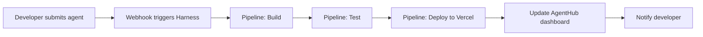

# AgentHub — Harness CI/CD Integration

**Status:** Ready to configure  
**Purpose:** Automate AgentHub deployments via Harness pipelines

---

## 📋 Prerequisites

1. **Harness Account** — Sign up at https://app.harness.io (free tier available)
2. **API Key** — Generate at https://app.harness.io/account/api-keys
3. **Git Repo** — AgentHub marketplace code on GitHub

---

## 🔧 Configuration Steps

### Step 1: Add Harness Credentials to TOOLS.md

Edit `/Users/subhuti/.openclaw/workspace/TOOLS.md`:

```markdown
### Harness.io

- Account ID: `<your-account-id>`
- API Key: `<your-api-key>`
- Org: `<org-identifier>`
- Project: `<project-identifier>`
```

### Step 2: Install harness-cli Skill

```bash
cd /Users/subhuti/.openclaw/workspace/skills/harness-cli
npm install -g .
```

### Step 3: Test Connection

```bash
export HARNESS_ACCOUNT_ID=<your-account-id>
export HARNESS_API_KEY=<your-api-key>
export HARNESS_ORG=<your-org>
export HARNESS_PROJECT=<your-project>

npx harness-cli list-pipelines
```

---

## 🚀 Pipeline: Deploy Agent

**File:** `.harness/pipelines/deploy-agent.yaml`

This pipeline deploys an agent to Vercel when triggered.

```yaml
pipeline:
  name: Deploy Agent
  identifier: deploy-agent
  projectIdentifier: agenthub
  orgIdentifier: default
  tags: {}
  stages:
    - stage:
        name: Build
        identifier: build
        description: Build agent package
        type: CI
        spec:
          cloneCodebase: true
          execution:
            steps:
              - step:
                  type: Run
                  name: Install Dependencies
                  spec:
                    command: npm install
              - step:
                  type: Run
                  name: Build Agent
                  spec:
                    command: npm run build --agent=${AGENT_ID}
              - step:
                  type: Run
                  name: Run Tests
                  spec:
                    command: npm test --agent=${AGENT_ID}
        when:
          stageStatus: All
    - stage:
        name: Deploy
        identifier: deploy
        description: Deploy to Vercel
        type: Deployment
        spec:
          execution:
            steps:
              - step:
                  type: Run
                  name: Deploy to Vercel
                  spec:
                    command: |
                      vercel login --token=${VERCEL_TOKEN}
                      cd marketplace
                      vercel --prod
          service:
            serviceRef: agenthub-service
          environment:
            environmentRef: production
        when:
          stageStatus: Success
  variables:
    - name: AGENT_ID
      type: String
      required: true
      description: Agent ID to deploy
    - name: VERCEL_TOKEN
      type: Secret
      required: true
      description: Vercel deployment token
  triggers:
    - trigger:
        name: Deploy on Agent Submit
        identifier: deploy-on-submit
        description: Triggered when developer submits agent
        type: Webhook
        spec:
          type: Github
          spec:
            actions:
              - Push
            branches:
              - main
```

---

## 🔄 Workflow: Developer Submits Agent



### Step-by-Step:

1. **Developer submits** via developer portal form
2. **Webhook fires** to Harness pipeline
3. **Build stage:**
   - Install dependencies
   - Build agent package
   - Run tests
4. **Deploy stage:**
   - Login to Vercel
   - Deploy to production
5. **Update dashboard** with new agent status
6. **Notify developer** via email

---

## 📊 Monitor Deployments

```bash
# List all pipeline executions
npx harness-cli list-executions --pipeline deploy-agent

# Get status of specific deployment
npx harness-cli get-deployment-status <execution-id>

# List feature flags (for gradual rollouts)
npx harness-cli list-feature-flags
```

---

## 🎯 Feature Flags (Optional)

Use Harness feature flags for:
- Gradual agent rollouts (10% → 50% → 100%)
- A/B testing agent versions
- Kill switch for problematic agents

**Example:**

```bash
# Enable new agent for 10% of users
npx harness-cli toggle-feature-flag new-agent-v2 --enabled

# Monitor, then scale to 100%
# If issues arise, disable immediately
npx harness-cli toggle-feature-flag new-agent-v2 --disabled
```

---

## 🔐 Security

### Required Secrets

Store these in Harness Secrets Manager:

| Secret | Description |
|--------|-------------|
| `VERCEL_TOKEN` | Vercel deployment token |
| `GITHUB_TOKEN` | GitHub API token (for webhooks) |
| `EMAIL_API_KEY` | Email service API key (for notifications) |

### API Key Permissions

Minimum Harness API key scope:
- `pipelines:read`
- `pipelines:execute`
- `feature-flags:read`
- `feature-flags:write`

---

## 📈 Benefits vs. Manual Vercel Deploy

| Feature | Manual Vercel | Harness Pipeline |
|---------|--------------|------------------|
| **Speed** | 2-5 min per deploy | Automated, <1 min |
| **Consistency** | Human error possible | Repeatable, tested |
| **Rollback** | Manual | One-click |
| **Feature Flags** | No | Built-in |
| **Audit Trail** | Limited | Full execution history |
| **Notifications** | Manual | Automated |
| **Testing** | Optional | Mandatory gate |

---

## 🚦 Next Steps

1. ✅ Create Harness account (if not exists)
2. ⏳ Generate API key
3. ⏳ Add credentials to TOOLS.md
4. ⏳ Test harness-cli connection
5. ⏳ Create pipeline in Harness UI or via YAML
6. ⏳ Configure webhook for developer portal
7. ⏳ Test end-to-end deployment

---

**Created:** April 15, 2026  
**Author:** Michael K C Lim  
**Status:** Ready for configuration
