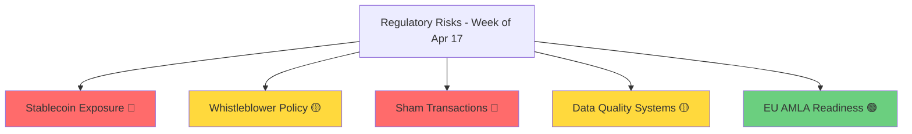

# Weekly Regulatory Early-Warning Briefing
## Week of April 17-23, 2026

**Prepared for:** Michael K C Lim  
**Date:** April 10, 2026, 8:00 AM SGT  
**Focus:** AML/CFT Compliance, Central Bank Policy, Crypto Regulation

---

## 📋 Executive Summary

This week's regulatory landscape shows **heightened enforcement activity** with three major red-flag developments:

1. **FinCEN's New AML Whistleblower Program** (Apr 2) — Expands incentives for reporting violations
2. **OFAC Sham Transactions Advisory** (Apr 1-2) — New red flags for sanctions evasion
3. **FCA's £44M Nationwide Penalty** (Mar 24) — Data quality failures as enforcement priority

**Key Risk:** 84% of illicit crypto activity now concentrated in stablecoins (FATF, Mar 2026) [1](https://fatf-gafi.org)

---

## 🗓️ Deadlines & Calendar

### This Week (Apr 17-23)
| Date | Event | Priority |
|------|-------|----------|
| None | — | — |

### Next 30 Days
| Date | Event | Action Required |
|------|-------|-----------------|
| Apr 29-30 | FOMC Meeting (US) | Monitor rate decision + AML/CFT mentions |
| May 2026 | EU AMLA CDD Draft RTS Consultation | Submit feedback |
| May 2026 | EU AMLA Enforcement & Sanctions RTS | Submit feedback |

### Central Bank Schedule
| Bank | Meeting | Status |
|------|---------|--------|
| Federal Reserve (US) | Apr 29-30 | Confirmed |
| ECB (EU) | TBC April | Pending |
| BOE (UK) | TBC Apr/May | Pending |
| MAS (Singapore) | TBC | Semi-annual review |

---

## 🔴 Critical Developments (Last 7 Days)

### 1. FinCEN: New AML Whistleblower Program Rule (Apr 2)
**Impact:** High  
**What Changed:** Expanded awards and protections for AML whistleblowers  
**Action:** Review internal reporting policies and update whistleblower procedures

### 2. OFAC: Sham Transactions Advisory (Apr 1-2)
**Impact:** High  
**What Changed:** New red flags for sanctions evasion through shell companies  
**Action:** Screen transactions for sham entity indicators

### 3. FATF: Stablecoin Illicit Finance Report (Mar 29)
**Impact:** Medium-High  
**Key Finding:** 84% of illicit crypto activity now in stablecoins  
**Action:** Review stablecoin exposure and enhance monitoring

### 4. FCA UK: Nationwide £44M Penalty (Mar 24)
**Impact:** High (precedent-setting)  
**Violation:** Data quality failures in AML systems  
**Action:** Audit customer data quality systems

---

## ✅ Action Items for Compliance Teams

| # | Action | Priority | Owner | Due |
|---|--------|----------|-------|-----|
| 1 | Review stablecoin exposure (FATF 84% finding) | High | | Apr 17 |
| 2 | Update whistleblower policies (FinCEN rule) | High | | Apr 24 |
| 3 | Screen for sham transaction red flags (OFAC) | High | | Apr 17 |
| 4 | Audit data quality systems (Nationwide precedent) | Medium | | Apr 30 |
| 5 | Prepare for EU AMLA implementation (2026-2027) | Medium | | May 15 |

---

## 📊 Risk Heat Map

**Legend:** 🔴 High | 🟡 Medium | 🟢 Low

---

## 🧭 Strategic Recommendations

### Immediate (This Week)
1. **Conduct stablecoin exposure review** — Given FATF's 84% illicit activity finding, prioritize transaction monitoring enhancements
2. **Brief team on OFAC sham transaction indicators** — Distribute advisory highlights to frontline staff

### Short-Term (Next 30 Days)
3. **Update whistleblower procedures** — Align with FinCEN's expanded program before Apr 24
4. **Data quality audit** — Use Nationwide penalty as case study for internal review

### Medium-Term (Q2 2026)
5. **EU AMLA preparation** — Begin gap analysis for CDD and Enforcement RTS requirements

---

## 📚 References

1. FATF (Mar 2026). "Stablecoin Illicit Finance Report" — fatf-gafi.org
2. FinCEN (Apr 2, 2026). "AML Whistleblower Program Rule" — fincen.gov
3. OFAC (Apr 1-2, 2026). "Sham Transactions Advisory" — treasury.gov/ofac
4. FCA (Mar 24, 2026). "Nationwide £44M Penalty Notice" — fca.org.uk

---

**Next Briefing:** April 17, 2026  
**Prepared by:** Subhuti 🪷
